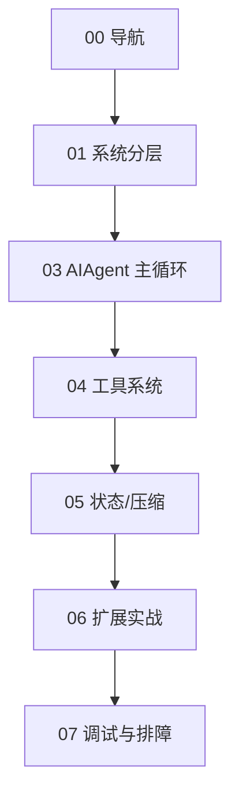

# 第 0 章：阅读导航与学习路径

## 你将学到什么

- Hermes Agent 的后端学习应该先抓哪三条主线。
- 如何把“看代码”变成“可执行走查”。
- 90 分钟内建立可用心智模型的方法。

## 三条主线（先背）

1. **主循环主线**：`run_agent.py` 的 `AIAgent` 如何不断调用模型与工具直到收敛。  
2. **工具主线**：`tools/*.py` 如何注册，`model_tools.py` 如何发现并暴露，`registry` 如何分发。  
3. **状态主线**：`hermes_state.py` 与 `context_compressor.py` 如何保障长会话与跨会话。

## 学习地图

## 90 分钟快速计划

- 0~15 分钟：读第 1 章，画四层架构图。
- 15~40 分钟：读第 3 章，画主循环状态机。
- 40~60 分钟：读第 4 章，画工具调用链。
- 60~75 分钟：读第 5 章，理解压缩与 SessionDB。
- 75~90 分钟：按第 6 章完成一个“假想改动设计”。

## 关键代码摘要

- `hermes_cli/main.py`：在模块导入前处理 profile，决定 `HERMES_HOME`。  
- `run_agent.py`：核心循环 + 工具执行 + 预算控制。  
- `model_tools.py`：工具发现/过滤/桥接。  
- `hermes_state.py`：SQLite + FTS5 会话层。

