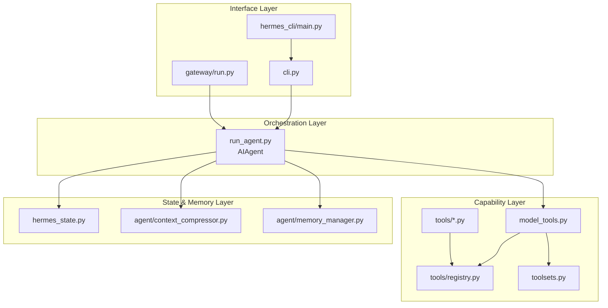

# 第 1 章：系统全景与分层架构

## 你将学到什么

- Hermes 后端的“层次化拆解”。
- 为什么入口层和执行内核要分离。
- 关键依赖链应该如何理解。

## 四层架构图



## 关键依赖链（后端最重要）

```text
tools/registry.py <- tools/*.py <- model_tools.py <- run_agent.py <- cli.py/gateway
```

## 为什么这样分层

- **接口层**只负责“如何接收输入、如何展示输出”。
- **编排层**负责“任务是如何被完成的”。
- **能力层**负责“能做什么事情（工具）”。
- **状态层**负责“跨时间保持一致性”。

## 关键代码摘要

### 摘要 1：入口不应该拥有业务策略

- 入口层如果承载策略逻辑，会造成 CLI/Gateway 分叉。
- 正确做法：把策略沉到 `run_agent.py` 或 `model_tools.py`。

### 摘要 2：工具能力必须由 schema/toolset 决定

- 不是“写在 prompt 里就算限制”。
- 真正的限制来自 `get_tool_definitions()` 输出。

### 摘要 3：状态层是连续性的保障

- 没有 `SessionDB + 压缩`，长会话会失稳，跨会话会失忆。

