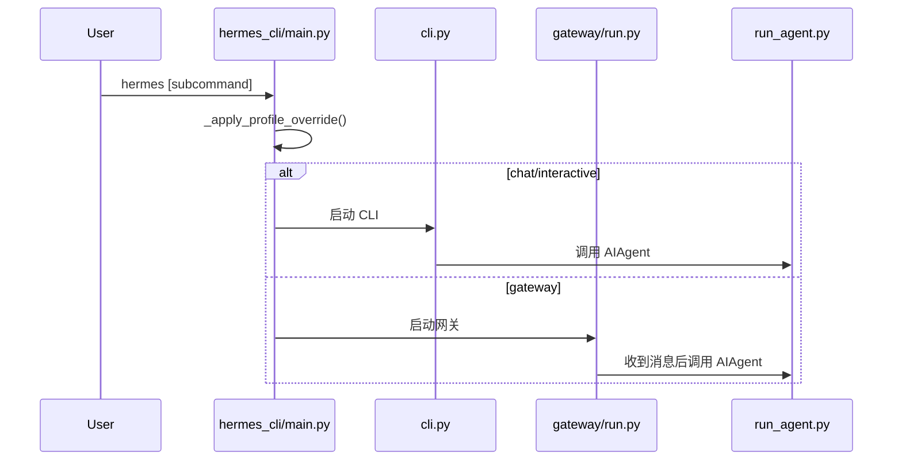

# 第 2 章：入口层（CLI/Gateway/ACP）执行流

## 你将学到什么

- `hermes` 命令如何进入不同运行形态。
- profile 覆盖为什么必须“先于 import”。
- gateway 与 CLI 的运行差异。

## 入口执行流图

## 关键点 1：profile override 时序

- `hermes_cli/main.py` 会先解析 `--profile/-p`。
- 在导入大部分模块前设置 `HERMES_HOME`。
- 原因：很多模块 import 时就计算路径常量。

## 关键点 2：gateway 的配置桥接

`gateway/run.py` 会把 `config.yaml` 的部分配置桥接成环境变量，兼容依赖 `os.getenv` 的逻辑路径。

典型桥接对象：
- terminal backend 与镜像
- auxiliary 模型设置
- agent 的 max_turns / timeout

## 关键点 3：CLI 与 Messaging 工作目录

- CLI：通常用当前目录。
- Messaging：通常由配置或 `MESSAGING_CWD` 控制。

这也是“同一指令在不同入口表现不同”的常见原因。

## 关键代码摘要

### 摘要 1：入口层只负责“接入”和“路由”

- 不应重复实现 Agent 策略。
- 不应复制工具分发逻辑。

### 摘要 2：入口层统一约束

- 所有入口都应复用 `AIAgent`，避免行为漂移。

