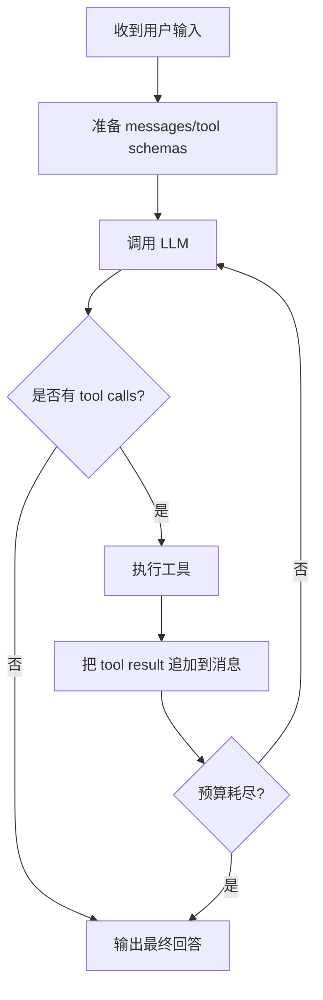

# 第 3 章：AIAgent 主循环深潜

## 你将学到什么

- `AIAgent` 的完整职责边界。
- 一轮会话如何在模型调用与工具调用之间循环。
- 为什么 `IterationBudget` 与并发边界是稳定性核心。

## 主循环总览



## 主循环阶段拆解

### 3.1 Prepare

- 构建系统提示（身份、行为、上下文文件、记忆块）。
- 注入历史消息。
- 根据 toolset 计算可用工具 schema。

### 3.2 Infer

- 向模型发起一次 chat completion。
- 模型可返回两类结果：
  1. 文本答案
  2. tool calls

### 3.3 Execute

- 对 tool calls 做执行。
- 根据工具类型选择串行或并发。
- 结果封装为 `tool` 消息回写到上下文。

### 3.4 Loop

- 每次工具执行后再次调用模型。
- 直到模型输出可直接返回的内容。

### 3.5 Finalize

- 保存会话状态。
- 清理 terminal/browser 等资源。
- 返回最终响应。

## `IterationBudget` 的工程意义

`IterationBudget` 并非锦上添花，而是“防失控”的兜底：

- 防无限循环（模型持续调用工具）。
- parent/subagent 预算可分离。
- 某些程序化工具调用可退款（refund），减少预算误伤。

## 工具并发策略（重要）

不是“能并发就并发”，而是按风险分层：

- 不可并发工具（交互型）
- 只读可并行工具
- 路径作用域工具（需判断路径冲突）

这保证系统在复杂任务中仍可控。

## 关键代码摘要（伪代码）

```python
while budget.remaining > 0:
    resp = llm(messages, tools)
    if resp.tool_calls:
        for tc in resp.tool_calls:
            result = dispatch(tc)
            messages.append(tool_message(result))
    else:
        return resp.text
```

> 真实实现会更复杂：包括并发策略、错误分类、上下文压缩触发、预算退款、环境清理等。

## 你最常改的点

- 消息组装策略（system/memory/context files）
- 工具执行策略（并发/超时/结果大小）
- 收敛策略（重试/失败语义/预算结束语义）

