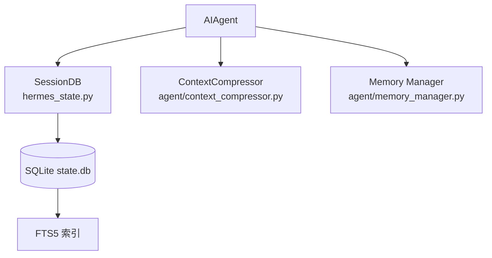

# 第 5 章：状态、记忆与上下文压缩

## 你将学到什么

- `SessionDB` 为什么选 SQLite + WAL + FTS5。
- 长会话下 `ContextCompressor` 如何分阶段压缩。
- 状态与记忆如何共同保障连续对话。

## 状态层架构图



## SessionDB：为什么这样设计

- `WAL`：支持高频读 + 单写并发模式。
- `FTS5`：会话消息可全文检索。
- 写冲突抖动重试：避免锁竞争下的“队头阻塞雪崩”。
- schema version：支撑后续迁移。

## ContextCompressor：不是一次性摘要

压缩流程通常是：

1. 先裁剪旧工具输出（低成本）。
2. 保护头部（系统语义）与尾部（最近上下文）。
3. 压缩中段历史。
4. 在后续压缩中做“摘要迭代更新”。

这样做的结果：
- 成本更可控。
- 丢失关键信息的风险更低。
- 长会话体验更稳定。

## 记忆系统的角色

记忆并不直接替代会话历史，而是：

- 以结构化方式补充长期信息；
- 与当前会话上下文共同作用于系统提示；
- 为跨 session 的连续性提供“长期锚点”。

## 关键代码摘要（伪代码）

```python
if compressor.should_compress_preflight(messages):
    messages = compressor.compress(messages)

session_db.append_messages(session_id, messages)
```

> 实际实现中还有 token 估算、阈值、失败冷却与可观测性字段。

