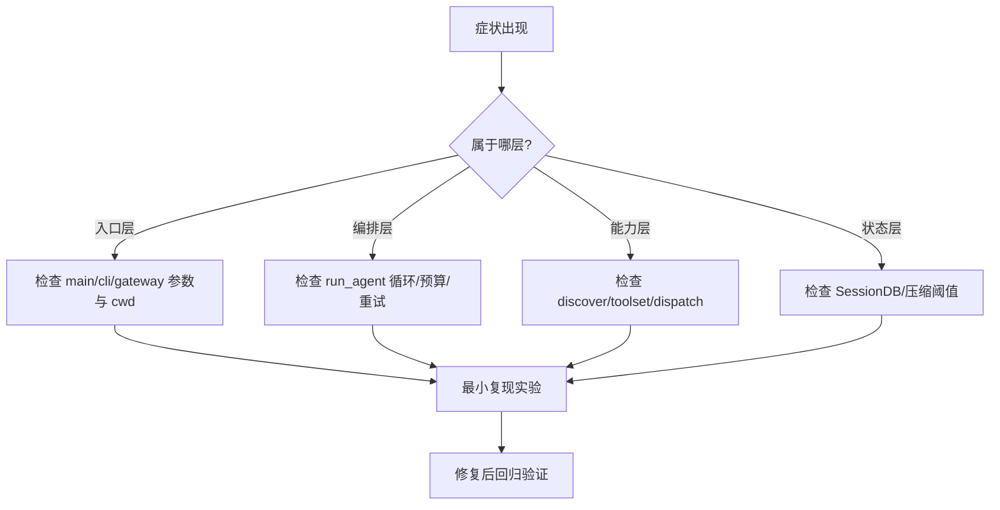

# 第 7 章：调试、测试与排障手册

## 你将学到什么

- 如何快速定位“工具不可用”“循环不收敛”“入口行为不一致”等问题。
- 推荐的分层调试顺序。
- 常见故障与修复路径。

## 调试总流程图



## 分层排障清单

### 1) 工具没有被模型调用

先查：
- 工具是否注册成功？
- 工具是否进入当前 toolset？
- `check_fn` 是否返回 True？
- schema 是否正确进入 `get_tool_definitions()`？

### 2) 工具调用后循环不收敛

先查：
- 是否持续返回不可解析内容？
- budget 是否被快速耗尽？
- 是否有并发引发状态冲突？

### 3) CLI 与 Gateway 行为不一致

先查：
- 是否工作目录不同？
- 是否配置桥接导致参数差异？
- 是否 profile 环境变量不一致？

## 推荐测试命令

```bash
python -m pytest tests/test_model_tools.py -q
python -m pytest tests/test_cli_init.py -q
python -m pytest tests/tools/ -q
python -m pytest tests/gateway/ -q
```

> 做核心改动前后建议跑全量：`python -m pytest tests/ -q`

## 关键代码摘要

- 工具问题：从 `model_tools.py` 的 discover/definitions 入手。  
- 收敛问题：从 `run_agent.py` 的预算与 tool loop 入手。  
- 长会话问题：从 `context_compressor.py` 阈值与摘要路径入手。  
- 历史检索问题：从 `hermes_state.py` 的 FTS 与写入路径入手。

